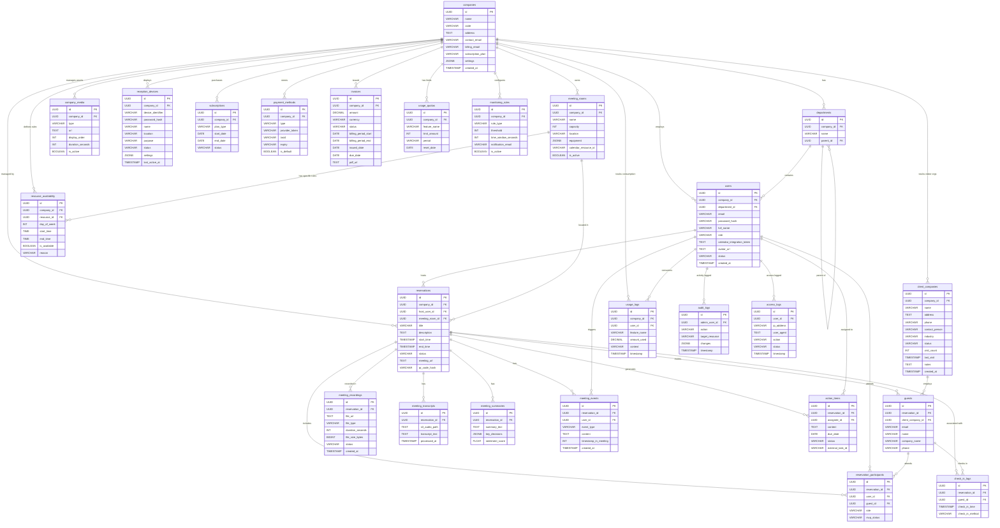

# Entity Relationship Diagram (ERD) - Office X

This document represents the database schema defined in `Database_EN.md` using Mermaid notation.

```mermaid
erDiagram
    %% Core Entities
    companies ||--o{ departments : "has"
    companies ||--o{ users : "employs"
    companies ||--o{ meeting_rooms : "owns"
    companies ||--o{ company_media : "manages assets"
    departments ||--o{ departments : "parent of"
    departments ||--o{ users : "contains"
    
    companies {
        UUID id PK
        VARCHAR name
        VARCHAR code
        TEXT address
        VARCHAR contact_email
        VARCHAR billing_email
        VARCHAR subscription_plan
        JSONB settings
        TIMESTAMP created_at
    }

    departments {
        UUID id PK
        UUID company_id FK
        VARCHAR name
        UUID parent_id FK
    }

    company_media {
        UUID id PK
        UUID company_id FK
        VARCHAR type
        TEXT url
        INT display_order
        INT duration_seconds
        BOOLEAN is_active
    }

    users {
        UUID id PK
        UUID company_id FK
        UUID department_id FK
        VARCHAR email
        VARCHAR password_hash
        VARCHAR full_name
        VARCHAR role
        TEXT calendar_integration_token
        TEXT avatar_url
        VARCHAR status
        TIMESTAMP created_at
    }

    %% Facilities & Resources
    companies ||--o{ reception_devices : "deploys"
    companies ||--o{ resource_availability : "defines rules"
    meeting_rooms ||--o{ resource_availability : "has specific rules"

    meeting_rooms {
        UUID id PK
        UUID company_id FK
        VARCHAR name
        INT capacity
        VARCHAR location
        JSONB equipment
        VARCHAR calendar_resource_id
        BOOLEAN is_active
    }

    reception_devices {
        UUID id PK
        UUID company_id FK
        VARCHAR device_identifier
        VARCHAR password_hash
        VARCHAR name
        VARCHAR location
        VARCHAR purpose
        VARCHAR status
        JSONB settings
        TIMESTAMP last_active_at
    }

    resource_availability {
        UUID id PK
        UUID company_id FK
        UUID resource_id FK
        INT day_of_week
        TIME start_time
        TIME end_time
        BOOLEAN is_available
        VARCHAR reason
    }

    %% Reservations & Reception
    companies ||--o{ reservations : "managed by"
    users ||--o{ reservations : "hosts"
    meeting_rooms ||--o{ reservations : "located in"
    
    reservations ||--o{ guests : "invites"
    reservations ||--o{ reservation_participants : "includes"
    users ||--o{ reservation_participants : "attends"
    guests ||--o{ reservation_participants : "attends"
    
    reservations ||--o{ check_in_logs : "associated with"
    guests ||--o{ check_in_logs : "checks in"
    
    client_companies ||--o{ guests : "employs"
    companies ||--o{ client_companies : "tracks visitor orgs"

    reservations {
        UUID id PK
        UUID company_id FK
        UUID host_user_id FK
        UUID meeting_room_id FK
        VARCHAR title
        TEXT description
        TIMESTAMP start_time
        TIMESTAMP end_time
        VARCHAR status
        TEXT meeting_url
        VARCHAR qr_code_hash
    }

    guests {
        UUID id PK
        UUID reservation_id FK
        UUID client_company_id FK
        VARCHAR email
        VARCHAR name
        VARCHAR company_name
        VARCHAR phone
    }

    reservation_participants {
        UUID id PK
        UUID reservation_id FK
        UUID user_id FK
        UUID guest_id FK
        VARCHAR role
        VARCHAR rsvp_status
    }

    check_in_logs {
        UUID id PK
        UUID reservation_id FK
        UUID guest_id FK
        TIMESTAMP check_in_time
        VARCHAR check_in_method
    }

    client_companies {
        UUID id PK
        UUID company_id FK
        VARCHAR name
        TEXT address
        VARCHAR phone
        VARCHAR contact_person
        VARCHAR industry
        VARCHAR status
        INT visit_count
        TIMESTAMP last_visit
        TEXT notes
        TIMESTAMP created_at
    }

    %% AI & Meeting Intelligence
    reservations ||--o{ meeting_recordings : "recorded in"
    reservations ||--o{ meeting_transcripts : "has"
    reservations ||--o{ meeting_summaries : "has"
    reservations ||--o{ meeting_events : "has"
    reservations ||--o{ action_items : "generates"
    users ||--o{ meeting_events : "triggers"
    users ||--o{ action_items : "assigned to"

    meeting_recordings {
        UUID id PK
        UUID reservation_id FK
        TEXT file_url
        VARCHAR file_type
        INT duration_seconds
        BIGINT file_size_bytes
        VARCHAR status
        TIMESTAMP created_at
    }

    meeting_transcripts {
        UUID id PK
        UUID reservation_id FK
        TEXT s3_audio_path
        TEXT transcript_text
        TIMESTAMP processed_at
    }

    meeting_events {
        UUID id PK
        UUID reservation_id FK
        UUID user_id FK
        VARCHAR event_type
        TEXT content
        INT timestamp_in_meeting
        TIMESTAMP created_at
    }

    meeting_summaries {
        UUID id PK
        UUID reservation_id FK
        TEXT summary_text
        JSONB key_decisions
        FLOAT sentiment_score
    }

    action_items {
        UUID id PK
        UUID reservation_id FK
        UUID assignee_id FK
        TEXT content
        DATE due_date
        VARCHAR status
        VARCHAR external_task_id
    }

    %% System & Billing
    companies ||--o{ subscriptions : "purchases"
    companies ||--o{ payment_methods : "stores"
    companies ||--o{ invoices : "issued"
    companies ||--o{ usage_quotas : "has limits"
    companies ||--o{ usage_logs : "tracks consumption"
    users ||--o{ usage_logs : "consumes"
    companies ||--o{ monitoring_rules : "configures"
    users ||--o{ audit_logs : "activity logged"
    users ||--o{ access_logs : "access logged"

    subscriptions {
        UUID id PK
        UUID company_id FK
        VARCHAR plan_type
        DATE start_date
        DATE end_date
        VARCHAR status
    }

    payment_methods {
        UUID id PK
        UUID company_id FK
        VARCHAR type
        VARCHAR provider_token
        VARCHAR last4
        VARCHAR expiry
        BOOLEAN is_default
    }

    invoices {
        UUID id PK
        UUID company_id FK
        DECIMAL amount
        VARCHAR currency
        VARCHAR status
        DATE billing_period_start
        DATE billing_period_end
        DATE issued_date
        DATE due_date
        TEXT pdf_url
    }

    usage_quotas {
        UUID id PK
        UUID company_id FK
        VARCHAR feature_name
        INT limit_amount
        VARCHAR period
        DATE reset_date
    }

    usage_logs {
        UUID id PK
        UUID company_id FK
        UUID user_id FK
        VARCHAR feature_name
        DECIMAL amount_used
        VARCHAR context
        TIMESTAMP timestamp
    }

    audit_logs {
        UUID id PK
        UUID admin_user_id FK
        VARCHAR action
        VARCHAR target_resource
        JSONB changes
        TIMESTAMP timestamp
    }

    access_logs {
        UUID id PK
        UUID user_id FK
        VARCHAR ip_address
        TEXT user_agent
        VARCHAR action
        VARCHAR status
        TIMESTAMP timestamp
    }

    monitoring_rules {
        UUID id PK
        UUID company_id FK
        VARCHAR rule_type
        INT threshold
        INT time_window_seconds
        VARCHAR notification_email
        BOOLEAN is_active
    }
```
